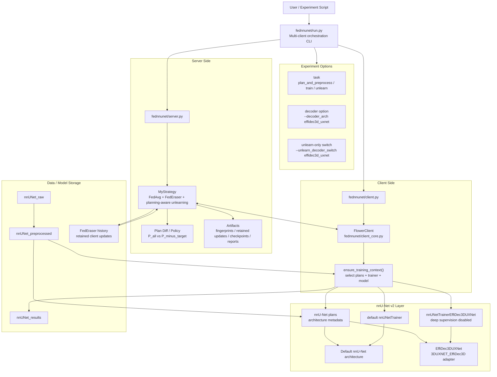
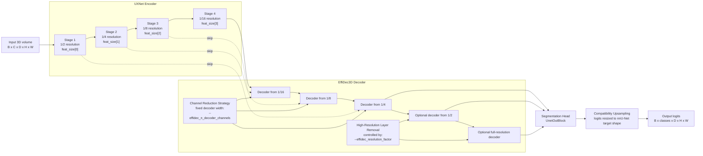
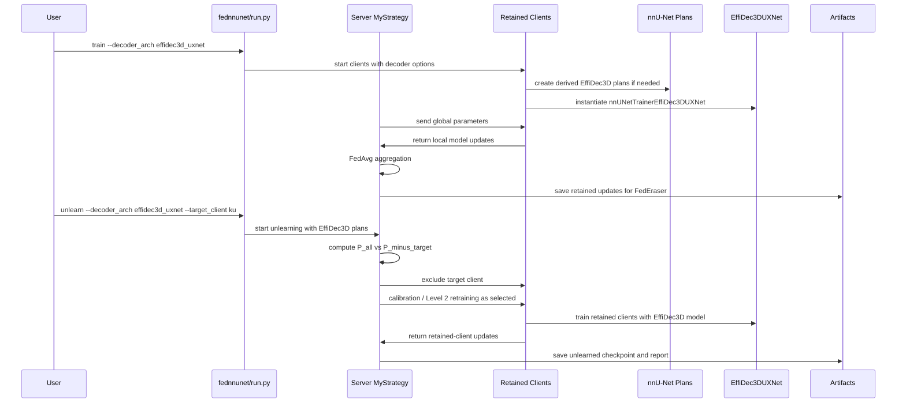
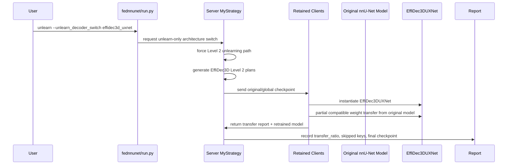

# FedUnlearning nnU-Net + EffiDec3D Architecture Diagram

## 1. 전체 프로젝트 구조



## 2. EffiDec3D 모델 내부 구조



Default setting in this update:

```text
--effidec_n_decoder_channels 48
--effidec_resolution_factor 2
```

This means the default EffiDec3D path uses both:

- channel reduction in the decoder
- removal of the full-resolution decoder stage, followed by output upsampling for nnU-Net compatibility

## 3. Train + Unlearn With EffiDec3D



## 4. Experimental Unlearn-Only Switch



## 5. 발표용 핵심 메시지

```text
The update integrates EffiDec3D as a selectable nnU-Net v2 architecture.
The integration is plan-driven, so the federated training and unlearning
pipelines can choose either the original nnU-Net model or the EffiDec3D UXNet
model without changing the core Flower/FedEraser protocol.

For efficiency, the implemented EffiDec3D path uses:
1. Channel Reduction Strategy via --effidec_n_decoder_channels
2. High-Resolution Layer Removal via --effidec_resolution_factor

The default configuration reduces decoder cost while resizing logits back to
the original nnU-Net segmentation target resolution.
```
